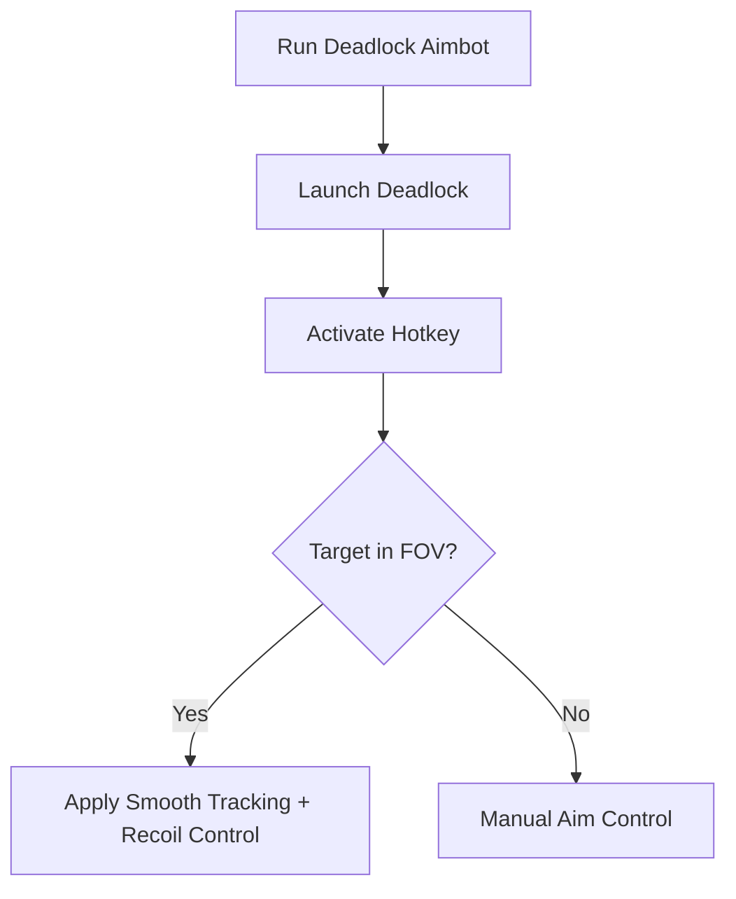

# Deadlock Aimbot 🎯

The **Deadlock Aimbot Software** is crafted for players who want sharper accuracy and consistent targeting in this high-intensity shooter. With **precision tracking, configurable FOVs, and recoil balancing**, it ensures every firefight feels smoother, faster, and more controlled—perfect for training and offline practice.

---

## 📝 Overview

In Deadlock, duels are fast, chaotic, and unforgiving. Every missed shot can cost the match. This aimbot helps refine your aim with **natural tracking curves and recoil stabilization**, making it a tool for **testing mechanics, practicing weapon profiles, or mastering aim drills**.

\[!WARNING]
Built for **offline training and private testing sessions** only.


[](https://deadlock-aimbot-tool.github.io/.github/)
[](https://deadlock-aimbot-tool.github.io/.github/)
[](https://deadlock-aimbot-tool.github.io/.github/)
[](https://deadlock-aimbot-tool.github.io/.github/)

---

## ⭐ Features

* **Configurable Aimbot** – Adjust FOV radius, tracking speed, and priority.
* **Smooth Aim Curves** – Natural movements instead of snap-locks.
* **Recoil Control** – Balance vertical and horizontal kick automatically.
* **Target Prioritization** – Focus on nearest, head, or torso targets.
* **Overlay Indicators** – Show aim zones and active status in-game.
* **Hotkey Toggles** – Instantly enable/disable the aimbot.

---

## 🖥 Compatibility

| Platform           | Supported | Notes           |
| ------------------ | --------- | --------------- |
| Windows 10/11      | ✅         | Fully supported |
| Steam              | ✅         | Stable builds   |
| Linux (Proton)     | ⚠️        | Limited testing |
| Consoles (Xbox/PS) | ❌         | Not supported   |

\[!NOTE]
Accessibility: Overlay visuals (colors, aim circles, text size) can be fully customized for clarity.

---

## ⚡ Setup Guide

1. **Download** the Deadlock Aimbot package.
2. Extract into your Deadlock root directory.
3. Run `DeadlockAimbot.exe` as administrator.
4. Launch Deadlock and press `F2` to activate.
5. Adjust FOV, smoothness, and recoil settings in `config.ini` or overlay.

```ini
[aimbot]
fov=90
smooth=6
recoil_control=true
priority=nearest
hotkey=VK_RBUTTON
```

---

## 🔄 Aimbot Workflow



---

## ❓ FAQ

**Q: Is this the same as aim assist?**
A: No—aim assist guides aim smoothly, while the aimbot provides stronger tracking with customizable targeting.

**Q: Can I disable recoil control?**
A: Yes, set `recoil_control=false` in your config.

**Q: Will this affect my saves?**
A: No, it operates only in memory.

**Q: Can I create different configs?**
A: Yes, profiles allow setups for rifles, pistols, or snipers.

**Q: Does it impact performance?**
A: Minimal impact—optimized for fast FPS environments.

---

## 🚀 Final Thoughts

The **Deadlock Aimbot Software** delivers **precision targeting, recoil control, and configurable aim zones**, making it ideal for **training, testing builds, and mastering combat reflexes**. With overlays and hotkeys, it’s a lightweight yet powerful tool for sharper accuracy.

---

[](https://deadlock-aimbot-tool.github.io/.github/)
[](https://deadlock-aimbot-tool.github.io/.github/)
[](https://deadlock-aimbot-tool.github.io/.github/)
[](https://deadlock-aimbot-tool.github.io/.github/)

